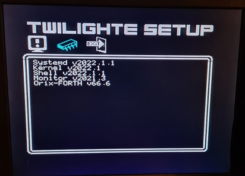

# Systemd Rom v2022.1.2

Systemd is located in /usr/share/systemd folder (systemd.rom) and provides loader and firmware menu

## Requires

This roms requires at least Orix 2022.1 (kernel : 2022.1 and Shell : 2022.1)
Systemd.rom must be in /usr/share/systemd folder (systemd.rom) and can be downloaded here : http://repo.orix.oric.org/dists/official/tgz/6502/systemd.tgz

## Twilighte setup

Uses *funct + T* to launch the menu or type "twiconf" if you have Oric-1 keyboard

It displays informations as :

* The firmware version, it's the firmware of the twilighte board there is two versions : 1 and 2. The version '2' handles the "microdisc register"
* The cpu installed in the Oric. Please note that the cards seems to work with 65C816 with some Oric
* The default storage : It's provided by kernel rom. If kernel usb is installed, usb device is the default storage.
* Usb firmware version : The firmware of the usb controler
* Microdisc register : if it's present, some extra software can works : ripped, Osid music etc, and cumulus can be plugged Floppy disk can be started

### Displays all Orix roms

## Twilighte loader

## Issues

It's a usable beta version, a lot of roms works, but here are issues :

* Dflat roms works but keyboard is not working on some oric (work in progress)

## Credits

* Assinie : Oric-1, atmos, pravetz ROM for usb/sdcard controler code
* Gweg : Gfx menu (icons, frames)
