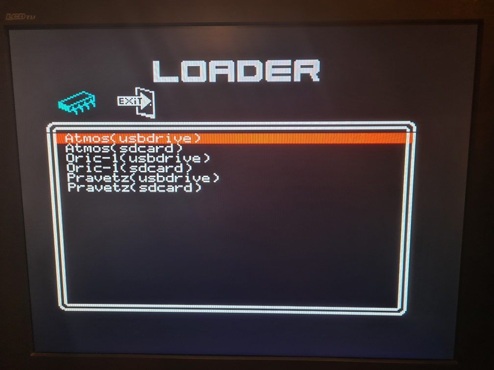

# Systemd Rom (beta)

Systemd is located in /usr/share/systemd folder (systemd.rom).

## Requires

This roms requires at least Orix 2021.4 (kernel : 2021.4 and Shell : 2021.4)
Systemd.rom must be in /usr/share/systemd folder (systemd.rom) and can be downloaded here : http://repo.orix.oric.org/dists/official/tgz/6502/systemd.tgz

## Twilighte setup

Uses funct + T to launch the menu

It displays informations as :

* The firmware version, it's the firmware of the twilighte board there is two versions : 1 and 2. The version '2' handles the "microdisc register"
* The cpu installed in the Oric. Please note that the cards seems to work with 65C816 with some Oric
* The default storage : It's provided by kernel rom. If kernel usb is installed, usb device is the default storage.
* Usb firmware version : The firmware of the usb controler
* Microdisc register : if it's present, some extra software can works : ripped, Osid music etc, and cumulus can be plugged Floppy disk can be started

## Twilighte loader

Uses funct + T to launch the menu

You can select the rom you want to start : 
* For atmos (usbdrive or sdcard), root path of the rom is /home/basic11 
* For Oric-1 (usbdrive or sdcard), root path of the rom is /home/basic10
* For Pravetzt (usbdrive or sdcard), root path of the rom is /home/pravetzt

## Issues

It's a usable beta version, a lot of roms works, but here are issues :

* Original rom (hardware tape) oric-1 and atmos does not work yet (work in progress)
* Dflat roms works but keyboard is not working (work in progress)
* Exit from twilighte firmware produces error when it returns to shell, the work around is to press reset
* Exit from twilighte loader produces error when it returns to shell, the work around is to press reset (Kernel bug)

## Credits

* Assinie : Oric-1, atmos, pravetz ROM for usb/sdcard controler code
* Gweg : Gfx menu (icons, frames)